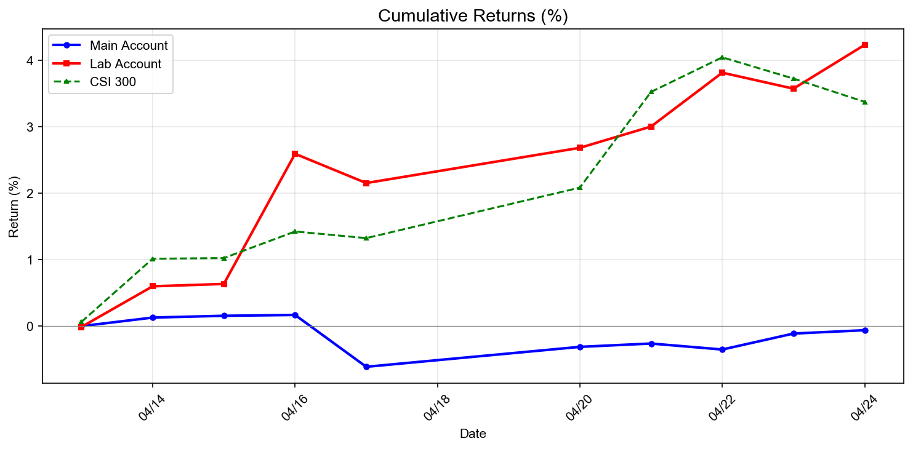
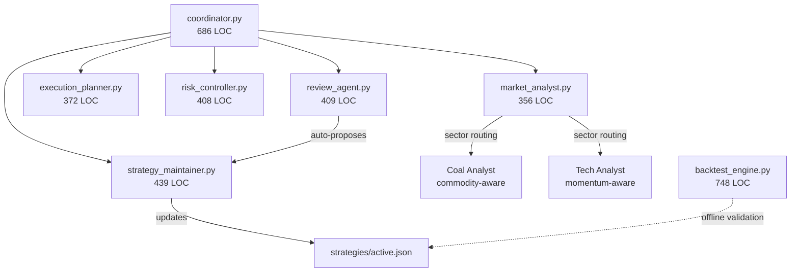
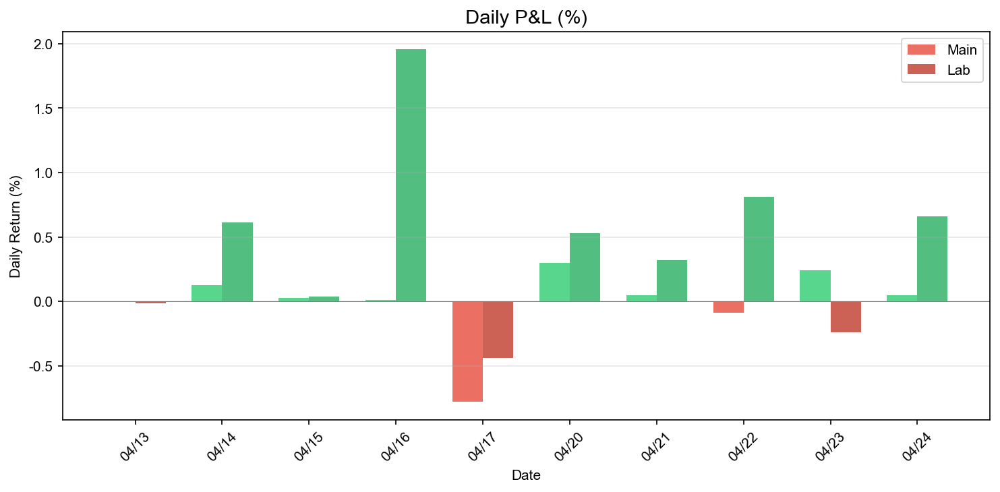
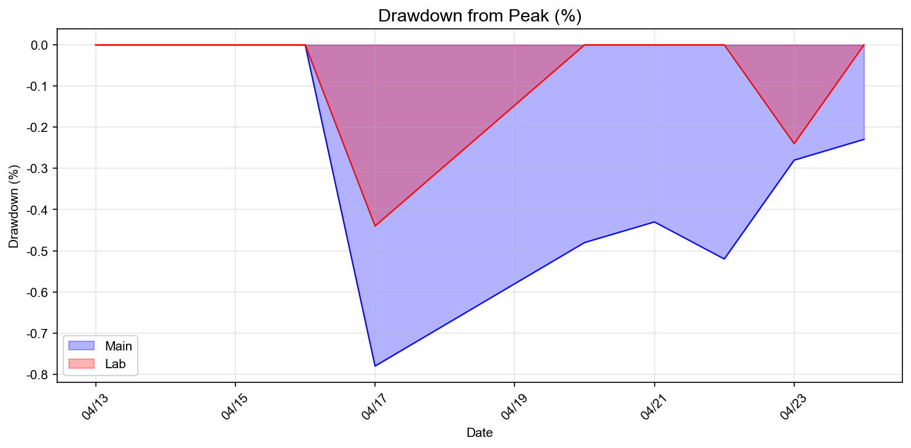
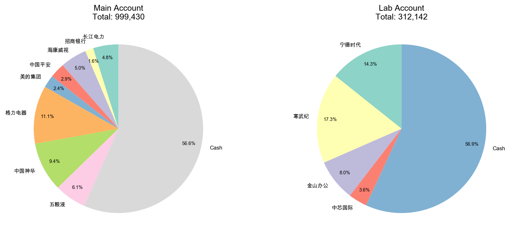

# Virtual Trader: 5-Agent Autonomous A-Share Trading System

> A production-grade multi-agent system for Chinese A-share trading,
> running autonomously on Hermes Agent since 2026-04-13.
> 19 days · 24 trades · W18: both accounts beat CSI 300.



---

## Why This Exists

A 5-agent autonomous trading system for Chinese A-shares. Inspired by
the multi-agent architectures explored in [tradingagents-fork](TBD,
will link in Week 2), but built ground-up for production deployment with
sector-aware analysis and self-iterating strategy refinement.

## The Coal Price Story (Origin of v1.0.5 / v1.0.6)

While analyzing **中国神华 (Shenhua Energy, 601088 — coal mining)**, the
original single-agent design produced a recommendation based purely on
price-volume + technical indicators, **ignoring coal commodity prices** —
the dominant fundamental driver for coal mining valuations.

**This was not a bug. It was an architectural blind spot**: a single
agent applying generic price-volume logic across all sectors will always
miss sector-specific factors (coal stocks → coal prices; bank stocks →
interest rates; new energy → lithium prices).

The fix had two parts:

1. **Multi-agent sector routing**: the coordinator (`coordinator.py`,
   686 LOC) now routes sector-tagged stocks to specialized analyst
   sub-pipelines. Coal-sector tickers invoke a commodity-aware analyst
   that ingests coal futures + inventory data as additional inputs.

2. **Self-iteration module**: the review agent (`review_agent.py`, 409 LOC)
   post-mortems every decision, identifies factors that were not in the
   input but turned out to be market-relevant, and auto-proposes the next
   strategy version into `strategies/changelog.json`.

**Evidence**: see `analysis/601088-shenhua-commodity-analysis.md` and
`analysis/601088-shenhua-comprehensive-analysis.md`.

**The lesson**: a trading system's value is not how often it's right
on day one — it's whether it can detect its own blind spots.

---

## Architecture



5 specialized agents coordinated by a central coordinator:

| Agent | LOC | Responsibility |
|---|---|---|
| `coordinator.py` | 686 | Workflow orchestration, sector routing |
| `market_analyst.py` | 356 | Market analysis (with sector-aware sub-routes) |
| `execution_planner.py` | 372 | Trade plan generation |
| `risk_controller.py` | 408 | Position sizing + risk gating |
| `review_agent.py` | 409 | Post-trade review + blind-spot detection |
| `strategy_maintainer.py` | 439 | Strategy version iteration |

Plus `backtest/backtest_engine.py` (748 LOC) for offline strategy validation.

**Total: 3,611 lines of Python across 11 files.**

---

## Real Performance (Through 2026-04-30)

| Metric | Main Account | Lab Account | Combined |
|---|---|---|---|
| Capital | 100k (demo) | 30k (demo) | 130k |
| Net Value | 101,167 | 31,478 | 132,645 |
| Cumulative Return | **+1.17%** | **+4.93%** | **+2.04%** |
| Max Drawdown | 0.78% | 0.44% | — |
| Positions | 9 | 2 | 11 |
| Trade Count | 12 | 11 | 23 |
| Days Running | 19 | 19 | — |

**W18 (4/27–4/30): both accounts beat CSI 300 for the first time.**

Best single trade: 寒武纪 (Cambricon, 688256) **+15.96%** over 16 days.

### Charts

| Cumulative Returns | Daily P&L | Drawdown | Position Distribution |
|---|---|---|---|
|  |  |  |  |

### Backtest (2026-04-13 ~ 2026-04-23)

| Metric | Main | Lab | CSI 300 |
|---|---|---|---|
| Cumulative return | -0.10% | +3.84% | +3.02% |
| Annualized return | -2.83% | +187.37% | +129.85% |
| Sharpe ratio | -0.06 | 0.53 | 0.60 |
| Max drawdown | 0.78% | 0.43% | 0.34% |
| Daily win rate | 75% | 75% | 62% |

---

## Tech Stack

- **Language**: Python 3 (3,611 LOC, 11 files)
- **Charting**: matplotlib (4 performance charts, auto-generated)
- **Data Sources**: Tencent Finance API (primary) → Sina Finance (backup) → yfinance (fallback)
- **Orchestration**: Hermes Agent cron jobs (5 scheduled tasks)
- **Storage**: JSON files (intentional — transparent, easy backup, no DB dependency)
- **Backup**: Shell scripts with automatic rotation (10 versions)

---

## Strategy Iteration

### Main Strategy (Value-Trend Hybrid): v1.0.0 → v1.0.5

| Version | Change | Trigger |
|---|---|---|
| v1.0.0 | Initial: high-ROE blue-chip + MA20/60 trend filter | — |
| v1.0.1 | Position floor (avoid going fully flat) | Cash drag identified |
| v1.0.2 | Min lot size (avoid micro-trades) | Fee drag on small positions |
| v1.0.3 | Clear-and-rebuild logic | Stale positions identified |
| v1.0.4 | **Commodity dimension input** | **Shenhua blind spot** |
| v1.0.5 | Refined entry filters + position floor 50% | Backtest cash drag -3.12% |

### Lab Strategy (Sector-Rotation Momentum): v1.0.0 → v1.0.6

| Version | Change | Trigger |
|---|---|---|
| v1.0.0 | Initial: volume breakout + MACD + sector rotation | — |
| v1.0.1 | Volume ratio 1.5→1.3 | Too few signals |
| v1.0.2 | Trailing stop 5%→6% | Premature exits |
| v1.0.3 | Volume ratio 1.3→1.4 | False breakout (阳光电源) |
| v1.0.4 | Parameter optimization | Performance review |
| v1.0.5 | Sector confirmation + turnover filter | False breakout pattern |
| v1.0.6 | **Scaled take-profit for high-beta sectors** | **Cambricon +20% missed** |

Each version triggered by a specific real-trading lesson — see
`strategies/changelog.json` for full rationale chain.

---

## How to Run

```bash
# Backup
scripts/backup.sh

# Integrity check
scripts/check_integrity.sh

# Generate performance charts (and upload)
python3 ~/.hermes/scripts/generate_charts.py [--upload]

# Run backtest
python3 backtest/backtest_engine.py

# Execute trade (single trade)
python3 scripts/execute_trade.py

# Update accounts and performance
python3 scripts/update_accounts.py
python3 scripts/update_perf.py
```

### Environment Variables

| Variable | Default | Description |
|---|---|---|
| `VTRADER_HOME` | `~/.hermes/virtual-trader` | Root directory for all data files |

### Hermes Cron Schedule (Beijing Time)

| Time | Task | Schedule |
|---|---|---|
| 08:00 | Daily finance update | Every day |
| 08:10 | Pre-market analysis | Mon–Fri |
| 15:30 | Post-market review | Mon–Fri |
| 08:00 Sat | Weekend full review | Saturday |

---

## Project Journey

This is the **production deployment**.

The research started with a fork of the [TradingAgents framework](TBD)
(LangGraph-based multi-agent trading research project). After studying
its architecture and running exploratory analyses on US stocks, I built
this from scratch as a production-focused, A-share-specialized,
self-iterating system. The fork lives at [tradingagents-fork](TBD,
linked in Week 2).

The two-project arc:

| Project | Role | What it shows |
|---|---|---|
| `tradingagents-fork` | Research playground | Reading and adapting open-source frameworks |
| `virtual-trader` (this) | Production system | Building from scratch, operating in real conditions, iterating from real lessons |

---

## Repository Layout

```
virtual-trader/
├── agents/         # 5 specialized agents + coordinator
│   ├── coordinator.py
│   ├── market_analyst.py
│   ├── execution_planner.py
│   ├── risk_controller.py
│   ├── review_agent.py
│   ├── strategy_maintainer.py
│   ├── config.json
│   └── workflows/     # Workflow execution records
├── accounts/       # Portfolio state (real data excluded, demo files included)
├── analysis/       # Per-stock deep analysis reports
├── backtest/       # Offline backtest engine (748 LOC)
├── insights/       # Daily insights (15 files)
├── market-data/    # Watchlist (cached data excluded)
├── references/     # Data schemas, API specs, risk rules
├── reports/        # Daily / weekly / backtest reports + charts
├── strategies/     # Active strategy + changelog + performance history
├── trades/         # Per-day trade records (14 trading days)
├── docs/           # Architecture, user guide, optimization docs
└── scripts/        # Operational scripts (backup, restore, charts, exec)
```

---

## Disclaimer

Demo / paper trading data. Not investment advice. Account values shown
are anonymized to demo equivalents (e.g., 100k demo units ≈ 1M RMB real),
not real money. Stock symbols are public market identifiers. Trade
decisions reflect the system's actual reasoning at the time, retained
verbatim for educational transparency.

---

## License

MIT

---

## Contact

GitHub: [@zhuosama](https://github.com/zhuosama)
